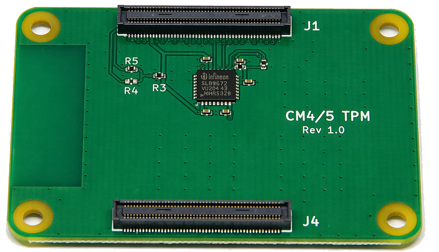
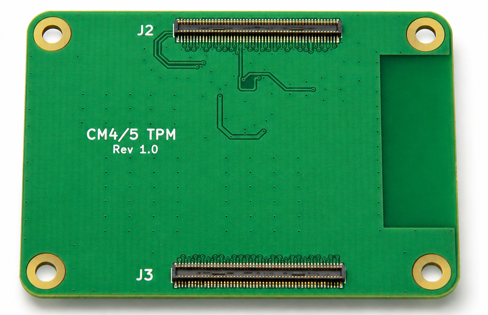
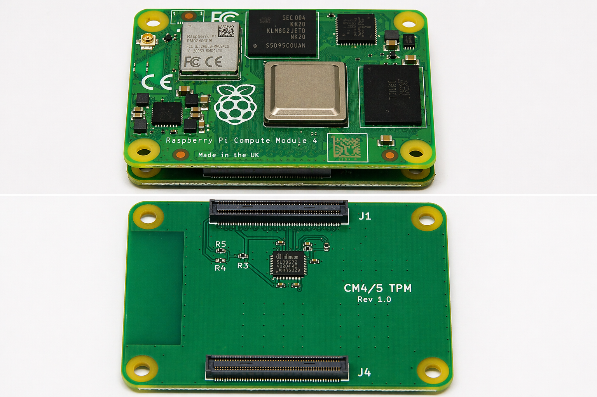
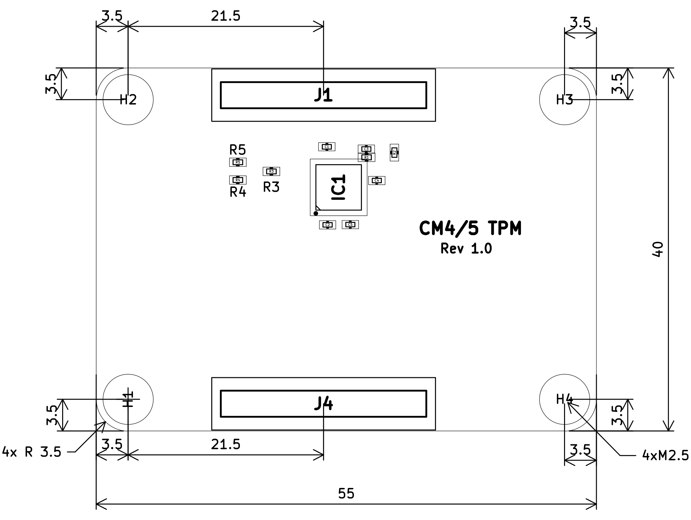
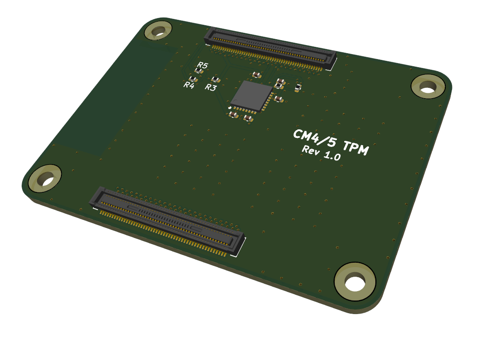
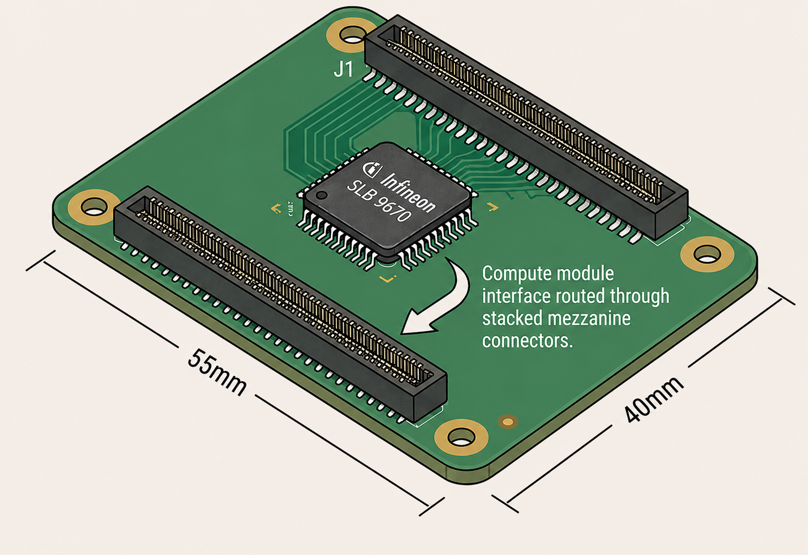
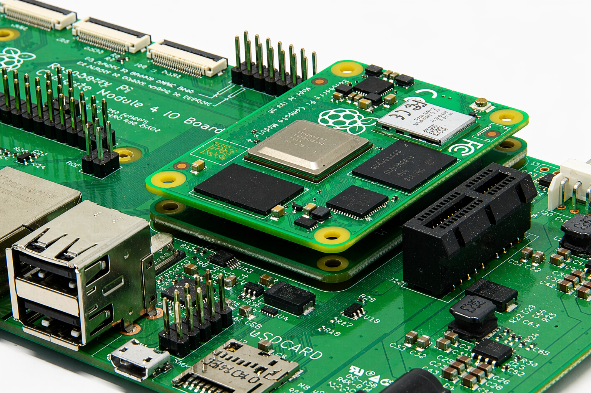
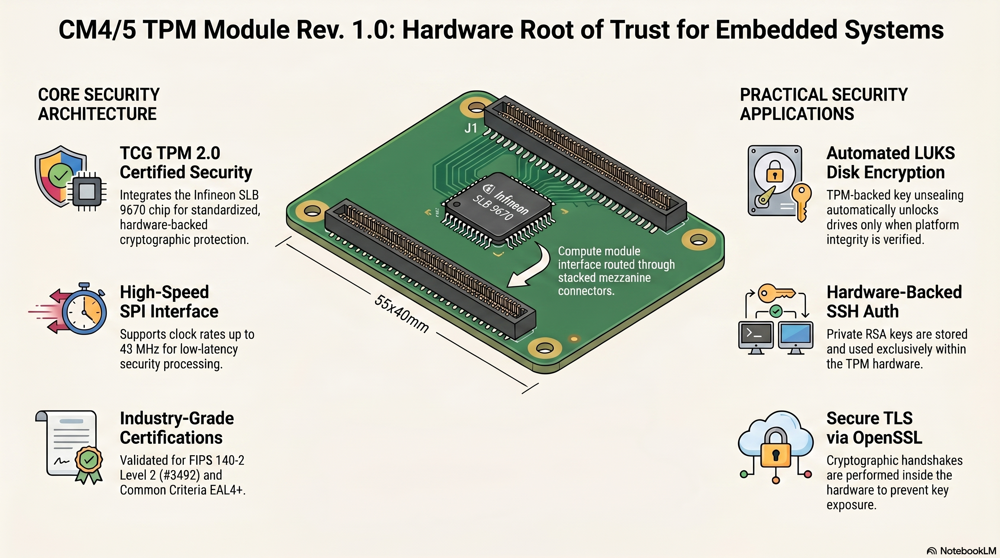

# CM4/5 TPM Module

**Trusted Platform Module stack-up for the Raspberry Pi Compute Module 4 & 5**

TPM IC: Infineon OPTIGA™ TPM SLB 9670VQ2.0 · Interface: SPI · Standard: TCG TPM 2.0
Revision 1.0 — 12 September 2026

<p align="center">
  
  
</p>

This repository holds the hardware documentation for the CM4/5 TPM Module together with
runnable software demos for the TPM features it exposes. The hardware chapters below are the
contents of [`docs/CM5_TPM_datasheet.pdf`](docs/CM5_TPM_datasheet.pdf); the
[software section](#software) covers bring-up and the worked examples.

- [Hardware](#hardware)
  - [1. Overview](#1-overview)
  - [2. Ordering information](#2-ordering-information)
  - [3. Connector and signal description](#3-connector-and-signal-description)
  - [4. Electrical characteristics](#4-electrical-characteristics)
  - [5. TPM properties](#5-tpm-properties)
  - [6. Reset timing](#6-reset-timing)
  - [7. Mechanical dimensions](#7-mechanical-dimensions)
  - [8. Compliance and certifications](#8-compliance-and-certifications)
  - [9. References](#9-references)
- [Software](#software)
  - [Quick start](#quick-start)
  - [Examples](#examples)
- [Repository layout](#repository-layout)

---

# Hardware

## 1. Overview

The CM4/5 TPM Module is a compact hardware security stack-up designed specifically for the
Raspberry Pi® Compute Module 4 (CM4) and Compute Module 5 (CM5). It integrates the Infineon
OPTIGA™ TPM SLB 9670VQ2.0, a TPM 2.0-compliant Trusted Platform Module, directly onto a
carrier PCB that mechanically and electrically interfaces with the CM4/5 high-density
connectors.

The board provides a hardware root of trust for Linux-based embedded security applications
including secure boot, remote attestation, disk encryption (e.g. via TPM-backed LUKS),
platform configuration measurement, and cryptographic key storage.

<p align="center">
  
</p>
<p align="center"><em>Figure 1: CM4/5 TPM adapter board stacked up with a Raspberry Pi® compute module.</em></p>

### 1.1 Key features

- Infineon OPTIGA™ TPM SLB 9670VQ2.0 — TCG TPM 2.0 compliant
- SPI interface, up to 43 MHz clock rate at 3.3 V
- FIPS 140-2 Level 2 validated (Certificate #3492)
- CC EAL4+ certified hardware security core
- Compatible with Raspberry Pi CM4 and CM5 via dual high-density board-to-board connectors
- 3.3 V single-supply operation with internal low-power management
- Built-in Linux kernel support (no proprietary drivers required)
- 24 PCRs (SHA-1 and SHA-256)
- Hardware random number generator (NIST SP800-90A)
- Full Endorsement Key (EK) personalization with EK certificate
- Standard operating temperature: −20 to +85 °C
- Compact stackable form factor; four M2.5 mounting holes

### 1.2 Applications

- Secure boot and measured boot (e.g. with UEFI or U-Boot TPM support)
- Full-disk encryption with TPM-backed key unsealing
- Remote attestation and device identity
- IoT edge security gateways
- Industrial embedded computing requiring hardware RoT
- Government and defense embedded platforms

## 2. Ordering information

**Table 1: Device variants**

| Part number | Description | Temp. range | Notes |
| --- | --- | --- | --- |
| CM45-TPM-R10 | CM4/5 TPM Module Rev. 1.0 | −20 to +85 °C | Standard version, SLB 9670VQ2.0 |

## 3. Connector and signal description

### 3.1 Board-to-board connectors

The CM4/5 TPM Module uses 4 100-pin high-density board-to-board connectors (J1, J2, J3, J4)
that are compatible with the standard Raspberry Pi CM4/CM5 connector footprint. These mate
directly with the corresponding connectors on the Compute Module.

**Table 2: Board connectors**

| Ref. | Type | Pitch / pins | Part number |
| --- | --- | --- | --- |
| J1 & J4 | High-density B2B | 0.4 mm / 100 | DF40C-100DS-0.4V(51) |
| J2 & J3 | High-density B2B | 0.4 mm / 100 | DF40C-100DP-0.4V(51) |

### 3.2 TPM signals mapped from CM4/5

The following signals are routed from the CM4/5 SPI bus and GPIO through the board-to-board
connectors to the SLB 9670 TPM IC. The receptacle connector pin numbers (as labelled in the
schematic) are listed alongside the TPM IC pin numbers.

**Table 3: TPM signal mapping**

| TPM IC pin | Signal | Receptacle pin | Direction | Description |
| --- | --- | --- | --- | --- |
| 19 | SCLK | 38 | Input | SPI clock (SPI mode 0 only) |
| 20 | CS0 | 39 | Input | Chip select 0, active low; default CS |
| 20 | CS1 | 37 | Input | Chip select 1, active low; **not populated** (DNP) |
| 21 | MOSI | 44 | Input | SPI data from CM4/5 to TPM |
| 24 | MISO | 40 | Output | SPI data from TPM to CM4/5 |
| 17 | RST# | 45 | Input | Reset, active low; connect to CM4/5 GPIO24 |
| 18 | PIRQ# | 41 | Output | Interrupt request, active low, open-drain |

> **Note**
> SPI mode 0 (CPOL=0, CPHA=0) is the only mode supported by the SLB 9670. The CM4/5 SPI
> controller must be configured accordingly in the device tree overlay.

## 4. Electrical characteristics

### 4.1 Absolute maximum ratings

> **Caution**
> Exposure to conditions beyond the absolute maximum ratings may cause permanent device
> damage. These are not operating conditions.

**Table 4: Absolute maximum ratings**

| Parameter | Min | Typ | Max | Unit | Condition |
| --- | --- | --- | --- | --- | --- |
| Supply voltage V<sub>DD</sub> | −0.3 | 3.3 | 5.0 | V | — |
| Voltage on any pin | −0.3 | — | V<sub>DD</sub>+0.3 | V | — |
| Ambient temperature | −20 | — | +85 | °C | Standard device |
| Storage temperature | −40 | — | +125 | °C | — |
| ESD (HBM, 1.5 kΩ / 100 pF) | — | — | 2000 | V | EIA/JESD22-A114-B |
| ESD (CDM) | — | — | 500 | V | STM5.3.1-1999 |
| Latch-up immunity | — | — | 100 | mA | EIA/JESD78 |

### 4.2 Functional operating range

**Table 5: Functional operating range**

| Parameter | Min | Typ | Max | Unit | Condition |
| --- | --- | --- | --- | --- | --- |
| Supply voltage V<sub>DD</sub> | 3.0 | 3.3 | 3.6 | V | — |
| Ambient temperature | −20 | — | +85 | °C | Standard device |
| Useful / operating lifetime | — | — | 10 | yr | Avg. T<sub>A</sub> = 55 °C |

### 4.3 Current consumption

**Table 6: TPM IC current consumption (T<sub>A</sub> = 25 °C, V<sub>DD</sub> = 3.3 V)**

| Parameter | Min | Typ | Max | Unit | Condition |
| --- | --- | --- | --- | --- | --- |
| Active mode current I<sub>VDD_Active</sub> | — | — | 25 | mA | During command execution |
| Sleep mode current I<sub>VDD_Sleep</sub> | — | 110 | — | µA | CS# inactive; no SPI transaction |

> **Note**
> The SLB 9670 automatically enters a low-power sleep state after each completed
> command/response transaction. No explicit sleep command is required.

### 4.4 SPI interface DC characteristics

**Table 7: DC characteristics — SPI pins (SCLK, CS#, MISO, MOSI, RST#, PIRQ#), V<sub>DD</sub> = 3.3 V**

| Parameter | Min | Typ | Max | Unit | Condition |
| --- | --- | --- | --- | --- | --- |
| Input high voltage V<sub>IH</sub> | 0.7 V<sub>DD</sub> | — | V<sub>DD</sub>+0.5 | V | SCLK, MISO, MOSI, CS# |
| Input low voltage V<sub>IL</sub> | −0.5 | — | 0.3 V<sub>DD</sub> | V | SCLK, MISO, MOSI, CS# |
| Input leakage current | −150 | — | +150 | µA | SCLK, CS#, MISO, MOSI |
| Output high voltage V<sub>OH</sub> | 0.9 V<sub>DD</sub> | — | — | V | I<sub>OH</sub> = −100 µA |
| Output low voltage V<sub>OL</sub> | — | — | 0.1 V<sub>DD</sub> | V | I<sub>OL</sub> = 1.5 mA |
| Pad input capacitance C<sub>IN</sub> | — | — | 10 | pF | — |
| Output load capacitance C<sub>LOAD</sub> | — | — | 40 | pF | MISO |

### 4.5 SPI interface AC characteristics

**Table 8: AC characteristics — SPI interface, V<sub>DD</sub> = 3.3 V**

| Parameter | Symbol | Min | Max | Unit | Condition |
| --- | --- | --- | --- | --- | --- |
| SCLK frequency | f<sub>CLK</sub> | — | 43 | MHz | t<sub>SLEW</sub> ≥ 1 V/ns |
| SCLK frequency | f<sub>CLK</sub> | — | 38 | MHz | t<sub>SLEW</sub> < 1 V/ns |
| CS# high time | t<sub>CS</sub> | 50 | — | ns | — |
| CS# setup time | t<sub>CSS</sub> | 5 | — | ns | CS# fall to SCLK rise |
| CS# hold time | t<sub>CSH</sub> | 5 | — | ns | SCLK fall to CS# rise |
| MOSI setup time | t<sub>SU</sub> | 2 | — | ns | To SCLK rising edge |
| MOSI hold time | t<sub>H</sub> | 3 | — | ns | From SCLK rising edge |
| MISO valid delay | t<sub>V</sub> | 0 | 0.7 t<sub>CLKL</sub> | ns | From SCLK falling edge |

## 5. TPM properties

**Table 9: TPM 2.0 capabilities (SLB 9670VQ2.0)**

| Property | Value |
| --- | --- |
| TPM specification | TCG TPM 2.0 (Family "2.0") |
| Manufacturer ID (`TPM_PT_MANUFACTURER`) | `"IFX"` |
| Platform Configuration Registers (PCRs) | 24 (SHA-1 and SHA-256) |
| Free NV memory | ≥ 6,962 bytes |
| Loaded sessions (min) | 3 (`TPM_PT_HR_LOADED_MIN`) |
| Active sessions (max) | 64 (`TPM_PT_ACTIVE_SESSIONS_MAX`) |
| Loaded transient objects (min) | 3 (`TPM_PT_HR_TRANSIENT_MIN`) |
| Loaded persistent objects (min) | 7 (`TPM_PT_HR_PERSISTENT_MIN`) |
| NV counters | ≤ 8 |
| Command/response buffer | ≤ 1,024 bytes |
| NV read/write size | ≤ 768 bytes |
| I/O buffer | 1,420 bytes |
| RNG standard | NIST SP800-90A |
| FIPS validation | FIPS 140-2 Level 2 (Certificate #3492) |
| CC certification | EAL4+ |
| Linux kernel support | Built-in (no out-of-tree driver needed) |

## 6. Reset timing

**Table 10: Device reset timing**

| Parameter | Symbol | Min | Max | Unit |
| --- | --- | --- | --- | --- |
| Cold (power-on) reset delay | t<sub>POR</sub> | — | 80 | µs |
| Warm reset pulse width | t<sub>WRST</sub> | 2 | — | µs |
| Reset inactive time (before first command) | t<sub>RSTIN</sub> | 60 | — | ms |

> **Caution**
> RST# must not be asserted within the t<sub>RSTIN</sub> window after deassertion. Violating
> this timing during power-on or warm boot may trigger the TPM's dictionary-attack protection
> mechanisms and potentially lock the device. Always issue `TPM2_Shutdown` before asserting
> RST#. TPM commands must only be started after t<sub>RSTIN</sub> has expired.

## 7. Mechanical dimensions

**Table 11: Board mechanical specification**

| Parameter | Value | Notes |
| --- | --- | --- |
| PCB outline | 55 mm × 40 mm | |
| Layer count | 2 | Standard FR4 stackup |
| PCB thickness | 1.6 mm | Standard |
| Mounting holes | 4 × M2.5 | 3.5 mm from each board edge |
| Corner radius | 4 × R3.5 mm | |
| Connector J1 / J4 | Centered at 25 mm from left edge | Top board edges |
| Connector J2 / J3 | Centered at 25 mm from left edge | Bottom board edges |
| Surface finish | ENIG | RoHS compliant |
| Solder mask colour | Green | — |

<p align="center">
  
</p>
<p align="center"><em>Figure 2: CM4/5 TPM Module Rev. 1.0 — PCB dimension drawing (all dimensions in mm).
Board outline 55 × 40 mm, mounting holes 4 × M2.5 at 3.5 mm from the edges, corner radii 4 × R3.5 mm.
Full drawing: <a href="docs/CM5_TPM_mechanical.pdf">docs/CM5_TPM_mechanical.pdf</a></em></p>

## 8. Compliance and certifications

**Table 12: Standards compliance**

| Standard / certification | Details |
| --- | --- |
| TCG TPM 2.0 | Family "2.0", compliant to TCG Spec Rev. 01.16 and Rev. 01.38 |
| FIPS 140-2 Level 2 | Certificate #3492 (16 July 2019) |
| Common Criteria | EAL4+ certified hardware security core |
| RoHS | PCB and components are RoHS compliant |
| Microsoft Windows | TPM qualifies for Windows platform certification |
| Google Chromebook | Meets Chromebook TPM certification criteria |
| Intel TXT | Compatible with Intel Trusted Execution Technology |

## 9. References

1. Infineon Technologies AG, *OPTIGA™ TPM SLB 9670 TPM2.0 Data Sheet*, Rev. 1.5, 2024-08-07 — [`docs/reference/Infineon_SLB_9670VQ2.0_DataSheet_v01_04_EN.pdf`](docs/reference/Infineon_SLB_9670VQ2.0_DataSheet_v01_04_EN.pdf)
2. TCG, *Trusted Platform Module Library (Parts 1–4)*, Family 2.0, Level 00, Rev. 01.38, 2016-09-29
3. TCG, *TCG PC Client Platform TPM Profile (PTP) Specification*, Family 2.0, Level 00, Rev. 01.03 v22, May 2017
4. Raspberry Pi Ltd., *Compute Module 4 Datasheet* — see also [`docs/reference/cm4io-datasheet.pdf`](docs/reference/cm4io-datasheet.pdf)
5. Raspberry Pi Ltd., *Compute Module 5 Datasheet* — [`docs/reference/cm5-datasheet.pdf`](docs/reference/cm5-datasheet.pdf), [`docs/reference/cm5io-datasheet.pdf`](docs/reference/cm5io-datasheet.pdf)
6. Hirose, *DF40C-100DS-0.4V(51) 2D drawing* — [`docs/reference/DF40C-100DS-0.4V-51_2D-drawing.pdf`](docs/reference/DF40C-100DS-0.4V-51_2D-drawing.pdf)

### Revision history

| Rev. | Date | Author | Changes |
| --- | --- | --- | --- |
| 1.0 | 12 September 2026 | — | Initial release |

> **Disclaimer:** this document is provided for informational purposes. Specifications are
> subject to change without notice. All trademarks are property of their respective owners.
> Infineon and OPTIGA are trademarks of Infineon Technologies AG. Raspberry Pi is a trademark
> of Raspberry Pi Ltd.

---

# Software

Hardware-backed security demos for Raspberry Pi CM4/5 + TPM 2.0.

Every example below is also available as a standalone script in [`scripts/`](scripts/), each
carrying a synopsis header that states what it does, what it needs, and what it writes. The
inline commands and the scripts are equivalent — use whichever suits you.

| Script | Purpose |
| --- | --- |
| [`tpm-check.sh`](scripts/tpm-check.sh) | Verify the TPM is detected and responding (read-only) |
| [`self-test.sh`](scripts/self-test.sh) | End-to-end create / load / sign test |
| [`tpm-init.sh`](scripts/tpm-init.sh) | Clear the TPM and create a fresh primary key (**destructive**) |
| [`luks-tpm-loop-demo.sh`](scripts/luks-tpm-loop-demo.sh) | TPM-backed LUKS unlock on a throwaway loop device |
| [`pcr-seal-unseal.sh`](scripts/pcr-seal-unseal.sh) | Seal a secret to the PCR state and unseal it again |
| [`ssh-tpm-setup.sh`](scripts/ssh-tpm-setup.sh) | Create a PKCS#11 token in the TPM and use it for SSH |
| [`ssh-tpm-test.sh`](scripts/ssh-tpm-test.sh) | Prove the TPM key alone is what authenticates you |
| [`ssh-tpm-remove.sh`](scripts/ssh-tpm-remove.sh) | List and delete TPM-backed SSH keys / tokens |
| [`tls-tpm-demo.sh`](scripts/tls-tpm-demo.sh) | TLS server and client using a key held in the TPM |
| [`cleanup.sh`](scripts/cleanup.sh) | Delete the on-disk artifacts the demos leave behind |

## Quick start

*Script: [`scripts/tpm-check.sh`](scripts/tpm-check.sh) — runs the verification steps below.*

Enable SPI and load the TPM driver overlay in config.txt so the system can communicate with the TPM 2.0 module at boot:

config.txt:
```
dtparam=spi=on
dtoverlay=tpm-slb9670
```
Install the required TPM tooling and basic utilities, then verify the TPM is responsive by requesting random bytes and running a simple self-test:

```
sudo apt update
sudo apt install tpm2-tools tpm2-abrmd openssl xxd

tpm2_getrandom 8 | xxd
./scripts/self-test.sh
```

## Examples

### LUKS TPM

*Script: [`scripts/luks-tpm-loop-demo.sh`](scripts/luks-tpm-loop-demo.sh) — runs Option B end to end.*

Install disk encryption support and initialize a LUKS volume, then bind it to the TPM so it can be unlocked automatically based on platform state.

`cryptsetup luksFormat` initializes a partition with LUKS encryption. You set a passphrase during this step — keep it safe as a recovery fallback.

`systemd-cryptenroll` then adds the TPM as a second unlock method. On subsequent boots, the TPM automatically provides the unlock key if the system state (PCR measurements) matches what was recorded at enrollment time — no passphrase prompt needed.

> **Warning:** Do not run `luksFormat` on `/dev/mmcblk0p2` if that is your live root partition — it will destroy the running OS. Use the loop device test below instead.

#### Option A — real partition

```
sudo apt install cryptsetup

cryptsetup luksFormat /dev/mmcblk0p2

systemd-cryptenroll --tpm2-device=auto /dev/mmcblk0p2
```

#### Option B — loop device (safe, no real disk needed)

This approach creates a temporary file on disk, attaches it as a virtual block device, and runs the full LUKS + TPM flow against that. Nothing touches your real storage. Cleanup is just deleting a file.

`dd` creates a 50 MB file filled with zeros. This becomes the backing store for the virtual disk.

`losetup -f --show` finds the next free loop device and attaches the file to it, making it appear as a real block device like `/dev/loop0`.

`cryptsetup luksFormat` initializes LUKS encryption on the loop device. You will set a passphrase here — it is needed for enrollment and as a recovery fallback.

`systemd-cryptenroll --tpm2-device=auto` seals a generated key inside the TPM and adds it as a second LUKS keyslot. After this, the TPM can unlock the volume automatically without the passphrase.

`systemd-cryptsetup attach` simulates what happens at boot — it asks the TPM for the key and opens the encrypted volume, making it available as `/dev/mapper/test-vol`.

`systemd-cryptsetup detach` closes the mapped volume when you are done.

`losetup -d` detaches the loop device. `rm test.img` removes the backing file completely.

```
# Create a 50 MB test image as a backing file
dd if=/dev/zero of=test.img bs=1M count=50

# Attach it as a loop device (note the device name printed, e.g. /dev/loop0)
sudo losetup -f test.img --show

# Initialize LUKS encryption on the loop device
sudo cryptsetup luksFormat /dev/loop0

# Enroll the TPM as an automatic unlock key (slot 1)
sudo systemd-cryptenroll --tpm2-device=auto /dev/loop0

# Simulate boot unlock — TPM provides the key automatically
sudo systemd-cryptsetup attach test-vol /dev/loop0 - tpm2-device=auto

# Verify the decrypted volume is available
ls /dev/mapper/test-vol

# Close the volume
sudo systemd-cryptsetup detach test-vol

# Clean up — detach loop device and delete the image
sudo losetup -d /dev/loop0
rm test.img
```

> **Note on PCR warnings:** On Raspberry Pi, `systemd-cryptenroll` may warn that selected PCRs are not initialized. This is expected — the Pi firmware does not implement measured boot the same way a PC does, so PCR-based anti-tamper enforcement is not active. The encryption itself still works correctly.

### Sealing

*Script: [`scripts/pcr-seal-unseal.sh`](scripts/pcr-seal-unseal.sh)*

Read selected PCR values, create a policy tied to those measurements, and seal a secret so it can only be unsealed when the system matches that state.

> **Note:** `tpm2-tools` commands require access to `/dev/tpmrm0`. Either prefix each command with `sudo`, or add your user to the `tss` group once and log back in:
> ```
> sudo usermod -aG tss $USER
> # log out and back in, then all commands below work without sudo
> ```

`tpm2_pcrread` prints the current PCR values — tamper-evident boot measurements. PCR 0 is firmware, PCR 1 is firmware configuration, PCR 2 is option ROMs. These values change if the boot chain is modified.

`tpm2_createprimary` creates a parent key in the TPM owner hierarchy. The sealed object will live under this parent. The context is saved to `primary.ctx` for use in subsequent commands.

`tpm2_createpolicy` calculates a digest of the current PCR values and writes it to `policy.bin`. This digest is what the TPM will check at unseal time.

`tpm2_create` seals the secret inside the TPM, locked to the policy. The output blobs (`seal.pub`, `seal.priv`) are stored on disk but are useless without the same TPM and matching PCR values.

`tpm2_load` loads those blobs back into the TPM to get an active object handle (`seal.ctx`).

`tpm2_startauthsession` opens a policy session — a temporary channel through which you prove conditions are met before the TPM grants access.

`tpm2_policypcr` replays the PCR policy inside the session, asserting that the current PCR values match the ones from `policy.bin`.

`tpm2_unseal` retrieves the plaintext secret from the TPM. It only succeeds if the policy session confirms that PCR values still match — i.e. nothing in the boot chain has changed since sealing.

`tpm2_flushcontext` closes the session handle to free TPM resources.

```
# Read current PCR values (informational)
sudo tpm2_pcrread sha256:0,1,2

# Create a primary key to use as the parent for sealing
sudo tpm2_createprimary -C o -c primary.ctx

# Create a policy tied to current PCR 0,1,2 values
sudo tpm2_createpolicy --policy-pcr -l sha256:0,1,2 -L policy.bin

# Seal the secret under that policy
echo "SECRET" > secret.txt
sudo tpm2_create -C primary.ctx -L policy.bin -i secret.txt -u seal.pub -r seal.priv
sudo tpm2_load -C primary.ctx -u seal.pub -r seal.priv -c seal.ctx

# Unseal: must satisfy the PCR policy via an authorized session
sudo tpm2_startauthsession --policy-session -S session.ctx
sudo tpm2_policypcr -S session.ctx -l sha256:0,1,2
sudo tpm2_unseal -c seal.ctx -p session:session.ctx
sudo tpm2_flushcontext session.ctx
```

### SSH TPM

*Scripts: [`scripts/ssh-tpm-setup.sh`](scripts/ssh-tpm-setup.sh), [`scripts/ssh-tpm-test.sh`](scripts/ssh-tpm-test.sh), [`scripts/ssh-tpm-remove.sh`](scripts/ssh-tpm-remove.sh)*

Set up a PKCS#11 interface backed by the TPM, create a token and key inside the TPM, and use it for SSH authentication without exposing private key material.

`tpm2_ptool init` creates a primary object in the TPM and initializes the local database (an SQLite store) that tracks tokens and keys.

`tpm2_ptool addtoken` creates a named PKCS#11 token — a PIN-protected logical container for keys inside the TPM. The SO PIN is an admin PIN for token management; the user PIN is used for day-to-day key operations.

`tpm2_ptool addkey` generates an RSA key pair inside that token. The private key is created inside the TPM and never exported. `--label` targets the token to add the key into; `--key-label` names the key within that token.

`find /usr/lib -name "libtpm2_pkcs11.so*"` locates the PKCS#11 shared library. SSH uses this library as a bridge to the TPM — it handles the signing operation internally so the private key never leaves hardware.

`ssh-keygen -D` reads and prints the public key from the PKCS#11 token in standard SSH format, so it can be registered on remote hosts.

`ssh -I` tells SSH to use the PKCS#11 library for authentication instead of a key file. The library asks the TPM to sign the server's challenge; the private key never leaves the chip.

```
sudo apt install libtpm2-pkcs11-1 libtpm2-pkcs11-tools

tpm2_ptool init
tpm2_ptool addtoken --pid=1 --label="tpm-token" --sopin=1234 --userpin=1234
tpm2_ptool addkey --algorithm=rsa2048 --label="tpm-token" --key-label="ssh-key" --userpin=1234

# Find the PKCS#11 library path on your system
find /usr/lib -name "libtpm2_pkcs11.so*" | head -1
# Typically: /usr/lib/aarch64-linux-gnu/libtpm2_pkcs11.so.1

PKCS11_LIB=/usr/lib/aarch64-linux-gnu/libtpm2_pkcs11.so.1

# Export the public key and copy it to the remote host (will prompt for password)
ssh-keygen -D $PKCS11_LIB | ssh user@host "mkdir -p ~/.ssh && cat >> ~/.ssh/authorized_keys && chmod 600 ~/.ssh/authorized_keys"

# Test login — the TPM will perform the private key operation internally
ssh -I $PKCS11_LIB user@host
```

#### Testing SSH TPM authentication

To prove that the TPM key specifically is being used (and not a fallback identity file or ssh-agent), use the flags below. They disable every other authentication path — only the PKCS#11 provider remains. If login succeeds, it is the TPM key. If it fails, something in the setup is incomplete.

```
PKCS11_LIB=/usr/lib/aarch64-linux-gnu/libtpm2_pkcs11.so.1

# Force a TPM-only public key login with no agent, no password, and no fallback identities
ssh -vv -o IdentitiesOnly=yes -o IdentityAgent=none -o PreferredAuthentications=publickey -o PasswordAuthentication=no -I $PKCS11_LIB user@host
```

#### Removing TPM SSH keys

> **Important:** Remove the public key from all remote `~/.ssh/authorized_keys` files *before* deleting the key from the TPM. Once deleted from the TPM, the private key is gone permanently and you will lose access to any host that still expects it.

`ssh-keygen -D` prints the public key so you can identify and remove the correct line from `authorized_keys` on the remote.

`tpm2_ptool listprimaries` and `listtokens` discover the actual token label — useful if you have forgotten it or used a non-default name.

`tpm2_ptool listobjects` shows all key objects in a token with their numeric `id` fields. Each RSA key pair appears as two objects: one private key and one public key, usually sharing the same `CKA_LABEL`.

`tpm2_ptool objdel` deletes a single object by its numeric `id` from `listobjects`. Note: this is not the `CKA_ID` hex string — it is the plain integer `id` field in the YAML output.

`tpm2_ptool rmtoken` removes the entire token and all keys inside it in one step.

```
# Print the public key to identify which line to remove from authorized_keys
PKCS11_LIB=/usr/lib/aarch64-linux-gnu/libtpm2_pkcs11.so.1
ssh-keygen -D $PKCS11_LIB
ssh user@host "sed -i '/PASTE_PUBLIC_KEY_HERE/d' ~/.ssh/authorized_keys"

# Discover the token label if you are not sure which one contains the SSH key
tpm2_ptool listprimaries
tpm2_ptool listtokens --pid=1

# List objects in the token once you know its label
tpm2_ptool listobjects --label="tpm-token"

# Delete both objects for the SSH key using the numeric id field from the list above
# Do not use the CKA_ID hex string here; objdel expects the top-level "id" integer.
tpm2_ptool objdel <private-object-id>
tpm2_ptool objdel <public-object-id>

# Or remove the entire token and all keys within it
tpm2_ptool rmtoken --label="tpm-token"

# Verify the key is gone — SSH should now fail
ssh -I $PKCS11_LIB user@host
```

### TLS TPM

*Script: [`scripts/tls-tpm-demo.sh`](scripts/tls-tpm-demo.sh)*

Create a TPM-backed key and use it with OpenSSL for a local TLS server test. The private key is generated inside the TPM and never written to disk in plaintext. OpenSSL communicates with the TPM through the `tpm2` provider for all signing operations.

`openssl genpkey -provider tpm2` generates a key pair where the private portion is created and stored inside the TPM. The output PEM file contains only a reference (handle) to the TPM object, not the actual private key bytes.

`openssl pkey -pubout` extracts the public key from that TPM-backed reference, safe to distribute.

`openssl req -new -x509` creates a self-signed certificate using the TPM key to sign it. This proves the signing operation happened inside the hardware.

`openssl s_server` starts a TLS server using the TPM-backed key and certificate. Every TLS handshake triggers a private key operation inside the TPM.

`openssl s_client` connects and completes the TLS handshake. A successful connection confirms the full chain works: TPM key → certificate → TLS.

`TPM2OPENSSL_TCTI=device:/dev/tpmrm0` tells the OpenSSL TPM provider to use the resource manager device. Without this, the provider may talk directly to the TPM and exhaust its limited object context slots, causing `out of memory for object contexts` errors.

```
sudo apt update
sudo apt install tpm2-tools tpm2-openssl openssl

# Basic TPM check
tpm2_getrandom 8 | xxd

# Point the OpenSSL TPM provider at the resource manager.
# Use sudo -E if running as root to preserve this variable.
export TPM2OPENSSL_TCTI=device:/dev/tpmrm0

# Generate a TPM-backed RSA 2048 key — private key never leaves the TPM
openssl genpkey -provider tpm2 -provider default -algorithm RSA -pkeyopt rsa_keygen_bits:2048 -out rsa_tpm_key.pem

# Extract and save the public key (optional, informational)
openssl pkey -in rsa_tpm_key.pem -provider tpm2 -provider default -pubout -out rsa_tpm_key.pub.pem

# Create a self-signed certificate signed by the TPM key
openssl req -new -x509 -key rsa_tpm_key.pem -provider tpm2 -provider default -subj "/CN=tpm-tls.local" -days 365 -out cert.pem

# Start a TLS server using the TPM-backed key (use -tls1_2 to avoid a known
# context-duplication bug in some tpm2-openssl builds on TLS 1.3)
openssl s_server -accept 8443 -cert cert.pem -key rsa_tpm_key.pem -provider tpm2 -provider default -www -tls1_2

# In another terminal, connect as client — a successful handshake confirms TPM TLS works
openssl s_client -connect 127.0.0.1:8443 -servername tpm-tls.local -tls1_2

# If you see "cannot duplicate context" / "out of memory for object contexts":
# flush stale TPM handles, then restart s_server
tpm2_flushcontext -t
tpm2_flushcontext -l
tpm2_flushcontext -s
```

---

# Repository layout

```
.
├── README.md
├── docs/                                # hardware documentation
│   ├── CM5_TPM_datasheet.pdf            # the datasheet reproduced above
│   ├── CM5_TPM_mechanical.pdf           # PCB dimension drawing
│   ├── CM5_TPM_overview_infographic.pdf
│   └── reference/                       # third-party datasheets
│       ├── Infineon_SLB_9670VQ2.0_DataSheet_v01_04_EN.pdf
│       ├── DF40C-100DS-0.4V-51_2D-drawing.pdf
│       ├── cm4io-datasheet.pdf
│       ├── cm5-datasheet.pdf
│       └── cm5io-datasheet.pdf
├── images/                              # renders, board shots, drawings
│   └── photos/                          # raw camera captures (JPG)
└── scripts/                             # the examples above, as runnable scripts
```

## Gallery

| | |
| --- | --- |
|  |  |
| Isometric render | Board outline, 55 × 40 mm |
|  |  |
| Stacked on a CM4 IO board | Alongside a Compute Module 4 |



## Source

[www.mubin.at](https://www.mubin.at)
